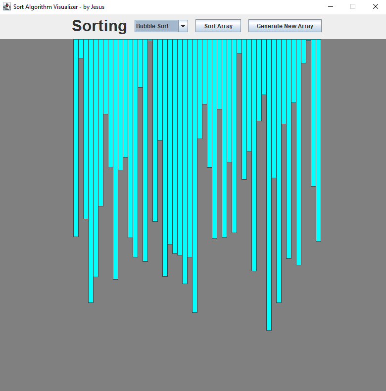
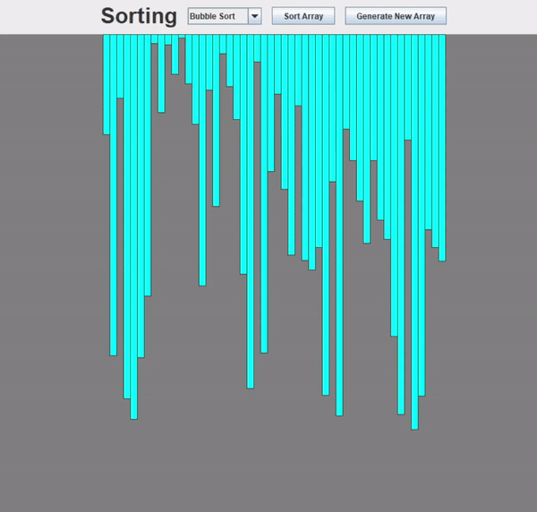
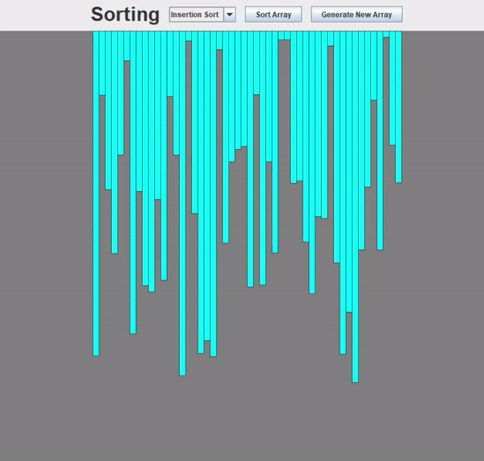
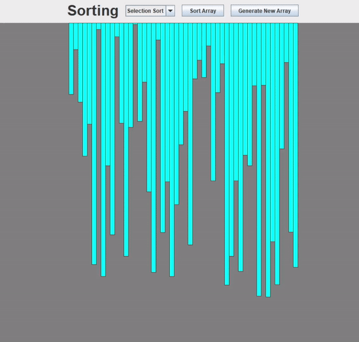
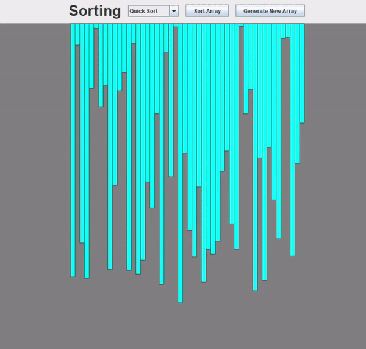

# Sort Algorithm Visualizer

> This is a personal project that I created to get some hands on some sort algorithms I've been learning about recently
> at College.

---

## Description

In this project I used Kotlin and Java Swing to build the GUI. The app contains a control panel on the top and the array
visualized in the center of the window where the algorithm visualization will occur.

On the control panel you can:

- Choose the sort algorithm that you want to visualize;
- Click the "Sort Array" button to start the visualization;
- Click the "Generate New Array" button to generate a new array;

---

## Sort Algorithms

I implemented six of the most known sort algorithms with different time complexities.

In the table below you can see the complexities of the different algorithms:

| Algorithm      | Time Complexity |
|----------------|-----------------|
| Bubble Sort    | O(n^2)          |
| Insertion Sort | O(n^2)          |
| Selection Sort | O(n^2)          |
| Heap Sort      | O(n(log n))     |
| Merge Sort     | O(n(log n))     |
| Quick Sort     | θ(n log(n))     |

### Bubble Sort

Bubble Sort is the simplest sorting algorithm that works by repeatedly swapping the adjacent elements if they are in
wrong order.

### Insertion Sort

Insertion sort is a simple sorting algorithm that works similar to the way you sort playing cards in your hands. The
array is virtually split into a sorted and an unsorted part. Values from the unsorted part are picked and placed at the
correct position in the sorted part.

### Selection Sort

The selection sort algorithm sorts an array by repeatedly finding the minimum element (considering ascending order)
from unsorted part and putting it at the beginning.

### Heap Sort

Heap sort is a comparison-based sorting technique based on Binary Heap data structure. It is similar to selection sort
where we first find the minimum element and place the minimum element at the beginning. We repeat the same process for
the remaining elements.

### Merge Sort

Merge Sort is a Divide and Conquer algorithm. It divides the input array into two halves, calls itself for the two
halves, and then merges the two sorted halves.

### Quick Sort

Like Merge Sort, QuickSort is a Divide and Conquer algorithm. It picks an element as pivot and partitions the given
array around the picked pivot.

---

## Author Info

- LinkedIn - [André Jesus](https://www.linkedin.com/in/andre-jesus-engineering)
- Twitter - [@andre_j3sus](https://twitter.com/andre_j3sus)
- Website - [André Jesus](https://andre-j3sus.github.io/)
